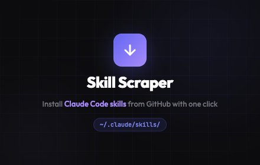
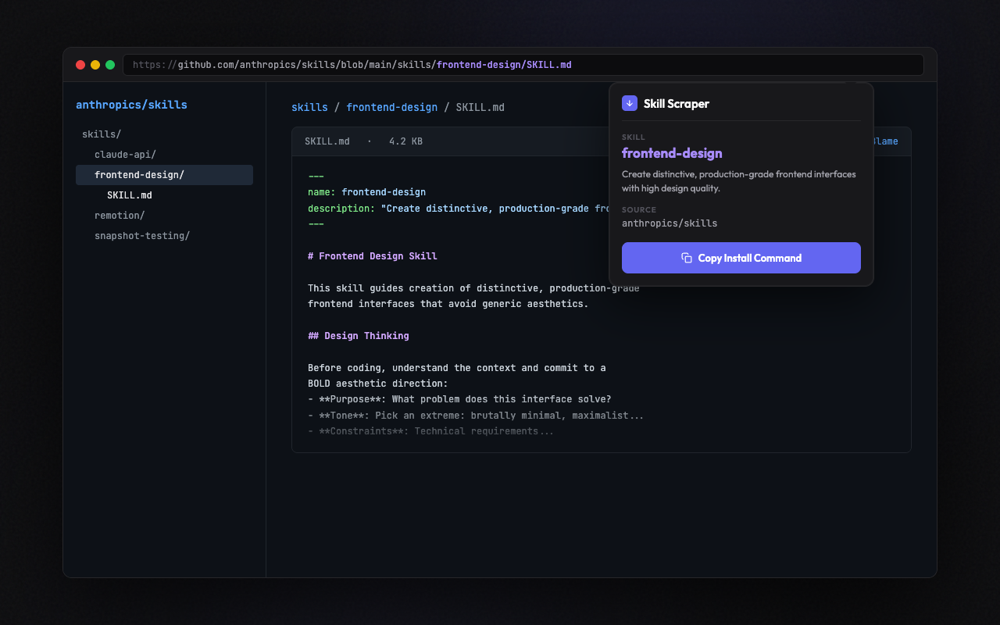
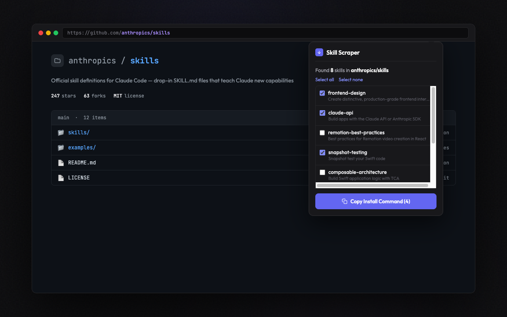
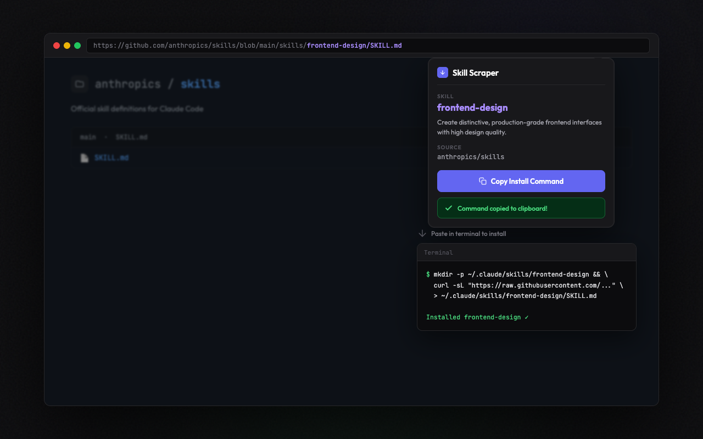

<p align="center">
  
</p>

<h1 align="center">Skill Scraper</h1>

<p align="center">
  <strong>Install Claude Code skills from GitHub with one click</strong><br>
  A Chrome extension that detects SKILL.md files on GitHub and copies a ready-to-run install command to your clipboard.
</p>

<p align="center">
  <a href="#install">Install</a> •
  <a href="#how-it-works">How It Works</a> •
  <a href="#supported-pages">Supported Pages</a> •
  <a href="#development">Development</a>
</p>

---

## How It Works

1. Browse any GitHub repo containing SKILL.md files
2. Click the extension icon — detected skills appear instantly
3. Hit **Copy Install Command** and paste it in your terminal
4. Done — the skill is installed to `~/.claude/skills/`

### Single Skill

Navigate to a SKILL.md file or its parent directory and install it directly.



### Multiple Skills

Browse a skills repo and batch-install the ones you want.



### One Command

The install command is copied to your clipboard — paste it in your terminal.



## Supported Pages

| GitHub URL Pattern | What Happens |
|---|---|
| `github.com/{owner}/{repo}/blob/{branch}/**/SKILL.md` | Detects the single skill, shows name & description |
| `github.com/{owner}/{repo}/tree/{branch}/skills/{name}` | Detects SKILL.md in the directory listing |
| `github.com/{owner}/{repo}` | Lists all skills in the `skills/` subdirectory |

## Install

### Chrome Web Store

Coming soon.

<!-- [**Install from Chrome Web Store →**](https://chrome.google.com/webstore/detail/...) -->

### Manual Install (Developer Mode)

1. Clone this repo:
   ```bash
   git clone https://github.com/anthropics/skill-scraper.git
   ```
2. Open `chrome://extensions` in Chrome
3. Enable **Developer mode** (top right)
4. Click **Load unpacked** and select the cloned directory
5. Navigate to a GitHub repo with SKILL.md files and click the extension icon

## What Are Claude Code Skills?

Skills are markdown instruction files that extend [Claude Code](https://docs.anthropic.com/en/docs/claude-code)'s capabilities. Each skill is a `SKILL.md` file installed to `~/.claude/skills/` that teaches Claude Code new behaviors, workflows, and domain expertise.

```
~/.claude/skills/
├── frontend-design/
│   └── SKILL.md
├── claude-api/
│   └── SKILL.md
└── snapshot-testing/
    └── SKILL.md
```

## Development

The extension is vanilla JS with zero dependencies. No build step required.

```
skill-scraper/
├── manifest.json              # MV3 extension manifest
├── content/content.js         # GitHub page detection
├── background/service-worker.js  # API calls & command generation
├── popup/                     # Extension popup UI
│   ├── popup.html
│   ├── popup.css
│   └── popup.js
├── utils/
│   ├── github.js              # URL parsing & API helpers
│   └── skill.js               # YAML frontmatter parser
└── icons/                     # Extension icons
```

## Privacy

- Only activates on `github.com` pages
- Fetches public file contents from the GitHub API
- No data is collected, stored, or sent to any third party
- No authentication required for public repos

## License

MIT
